# Clinic Accounting System

Clinic Accounting System tech stack:
* Java 8.
* Spring Boot 2, JPA.
* MySQL 8.
* JSP, JSTL, EL.
* HTML, JS, Bootstrap, Datatables, Date picker.
* JavaMail.

## Functionality overview:

* Sign In.
* Registration.
* Password recovery by email.
* Administrator
  * Can view/sort/search/add/delete `common` and `only for personal` events.
  * Can view/sort/search/add/delete doctors.
  * Can view/sort/search/edit/delete patients.
  * Can view/sort/search appointments and delete all old non-closed appointments by date.
* Doctor
  * Can view/sort/search/add `common` and `only for personal` events.
  * Can view/edit his own credentials and personal info.
  * Can view/sort/search doctors and make an appointment to other doctor.
  * Can view/sort/search patients and make edits in patient's medical history.
  * Can view/sort/search `him as a doctor` appointments and close them with a note in medical history.
  * Can view/sort/search `him as a patient` appointments.
* Patient
  * Can view/sort/search `common` events.
  * Can view/edit his own credentials and personal info.
  * Can view/sort/search doctors and make appointments to them.
  * Can view/sort/search his own appointments.

## Screenshots

### Sign In

### Registration

#### Username and password

#### Personal info application

### Password recovery by email

### Patient

#### Managing account info
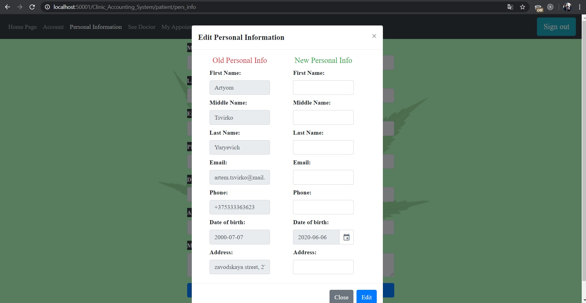

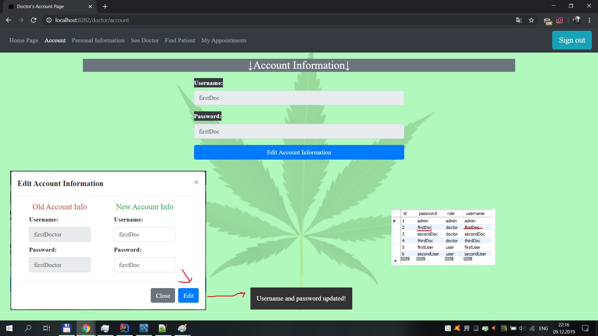

#### Making appointments

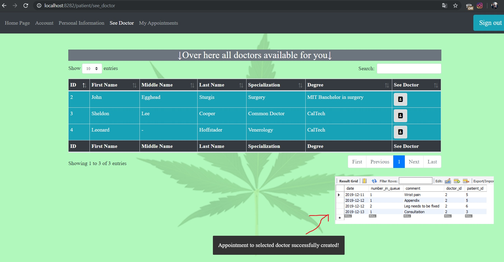

### Doctor

#### Home Page

#### Creating new events

#### Personal information page

##### As patient

##### As doc

##### Changing personal info

#### Managing patients

#### Managing appointments

### Admin

#### Home
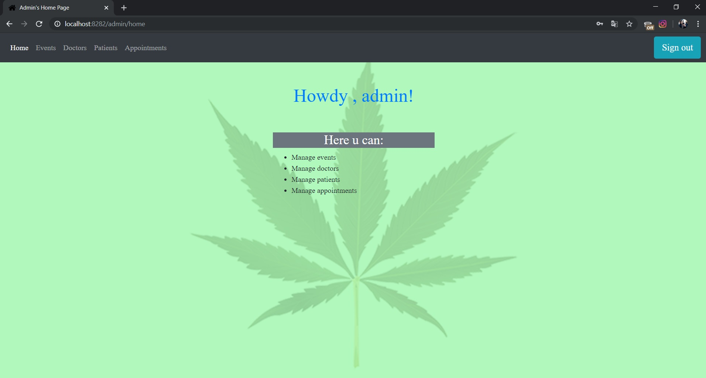

#### Managing events
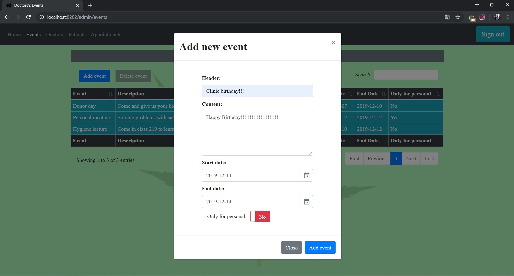
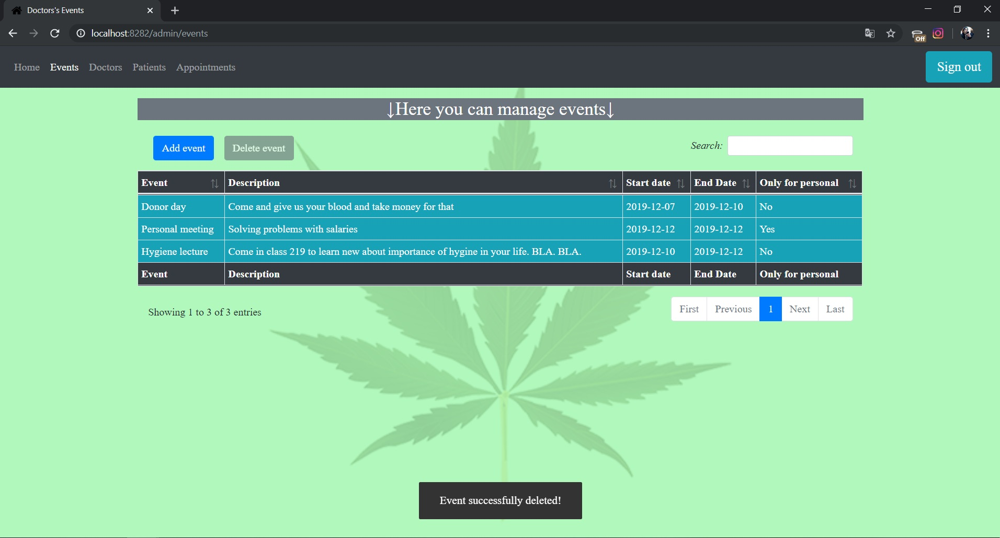

#### Managing doctors
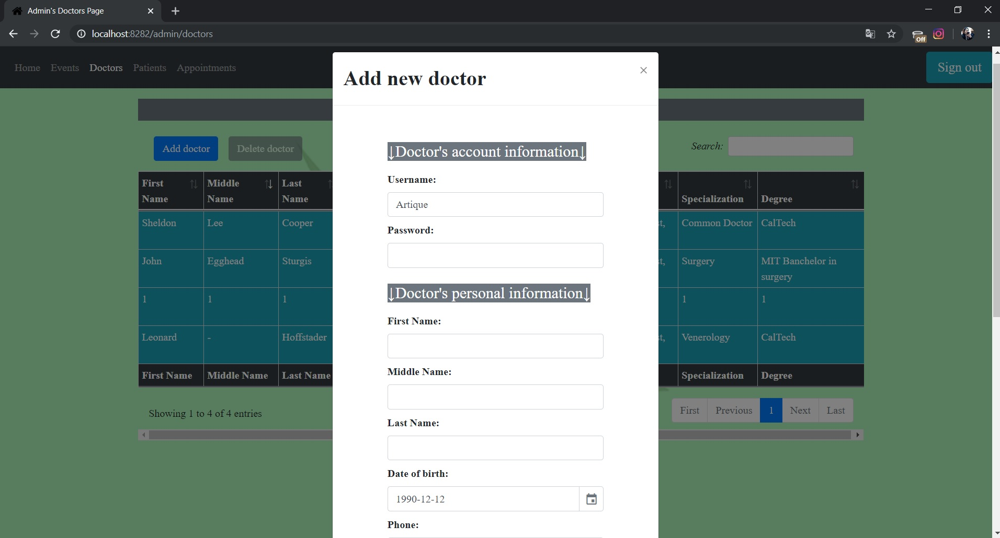

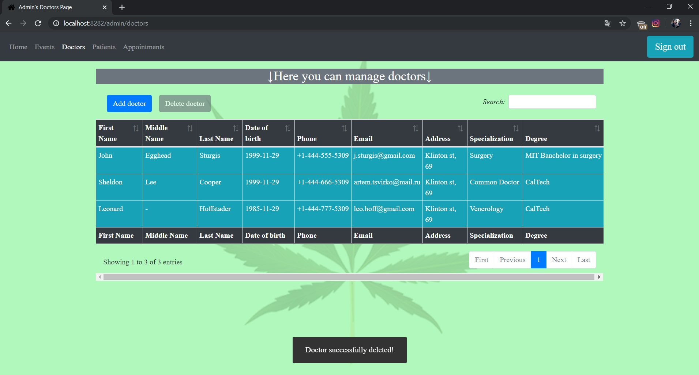

#### Managing patients
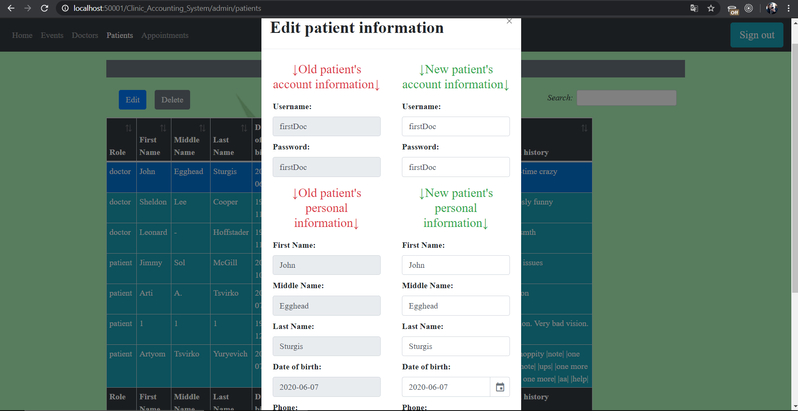
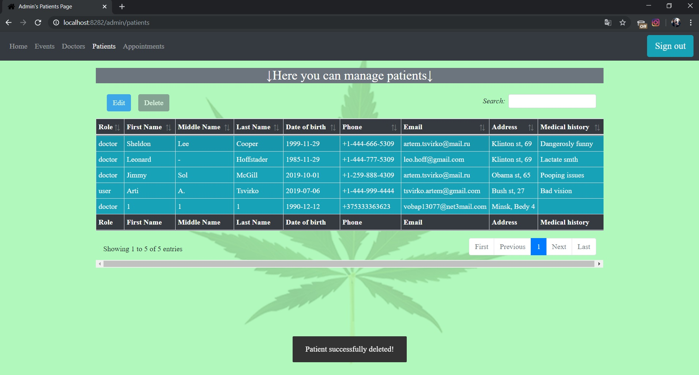

#### Managing appointments
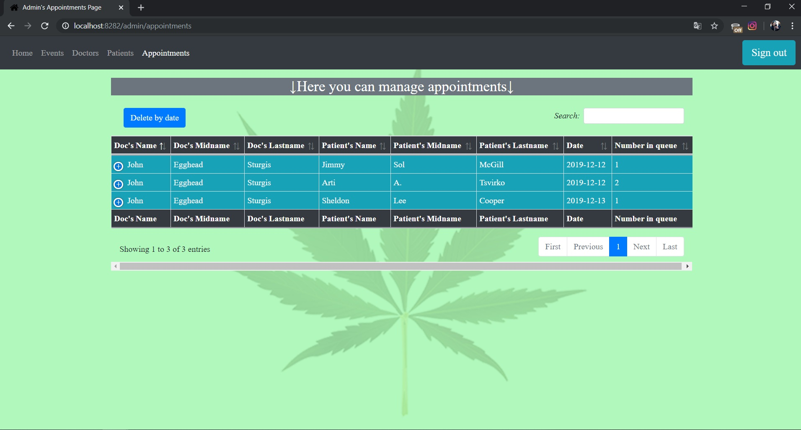
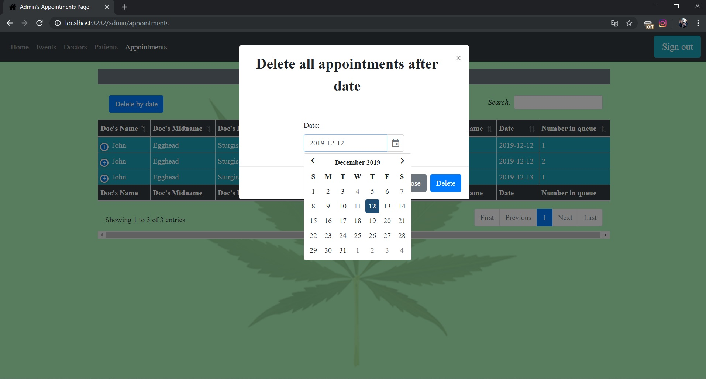
